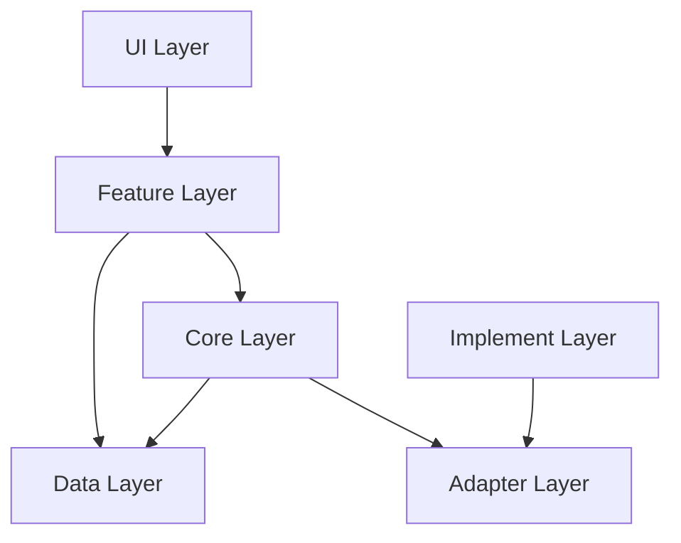

# 架构基本法

本文档定义了项目的核心架构原则。所有开发活动必须严格遵循此规范，确保系统的可维护性、可测试性和可扩展性。

## 1. 核心原则
- **分层架构**：系统严格按层级划分，禁止跨层或反向依赖。
- **单向数据流**：数据从 Data 层向上流动，事件/指令从 UI 层向下传递。
- **关注点分离**：每一层和每一个模块只关注自己的职责。
- **接口编程**：跨层依赖必须通过抽象接口（Core 依赖 Adapter 接口），而非具体实现。

## 2. 层次结构 (Layering)

系统采用经典的整洁架构变体，分为以下 6 层：



| 层级 | 职责 | 依赖方向 | 允许包含的内容 |
|------|------|----------|----------------|
| **UI** | 纯粹的界面展示，不含业务逻辑 | Feature | Pages, Widgets, Router |
| **Feature** | 用于 UI 的业务逻辑适配 (MVVM/Presenter) | Core, Data | Providers, ViewModels, UI Logic |
| **Core** | **核心业务逻辑域**，纯 Dart 代码 | Data, Adapter | Domain Services, Validators, Entities |
| **Adapter** | 定义外部依赖的**抽象接口 (Ports)** | 无 | Abstract Classes (Interfaces) |
| **Implement**| 第三方库或基础设施的**具体实现** | Adapter | 3rd-party SDK wrappers (Filesystem, API) |
| **Data** | 数据的定义与存储 | 无 | Repositories, Models, Storage (DB/API) |

### 依赖规则详解
1.  **UI → Feature**: UI 只负责渲染 Feature 提供的状态，将用户交互转交 Feature 处理。
2.  **Feature → Core/Data**: Feature 组合 Core 提供的原子能力，同时可直接读取 Data 层的只读模型（Read Models）。
3.  **Core → Data**: Core 依赖 Data 层提供的 Repository 接口进行数据存取。
4.  **Core → Adapter**: Core 绝不依赖具体的三方库（如 Flutter SDK, Http client），只依赖定义在 Adapter 层的接口。
5.  **Implement → Adapter**: 具体实现层负责实现 Adapter 接口。这也是**依赖倒置**的关键点。

## 3. 目录与包结构

建议采用 Feature-First 结合 Layer-First 的混合结构，但核心分层必须清晰。

```text
lib/
├── app/                      # 应用级配置
│   ├── di.dart               # 依赖注入 (Dependency Injection)
│   ├── theme/                # 全局主题
│   └── events/               # 全局事件定义
│
├── core/                     # 核心业务域 (Domain Layer)
│   ├── auth/                 # 认证域
│   ├── reaction/             # 反应域 (举例)
│   │   ├── services/
│   │   └── logic/
│   └── ...
│
├── data/                     # 数据层 (Data Layer)
│   ├── models/               # 数据模型 (Entities/DTOs)
│   ├── repositories/         # 仓库实现
│   └── sources/              # 数据源 (API/DB)
│
├── adapter/                  # 适配器接口 (Ports)
│   ├── log_port.dart         # 日志接口
│   └── storage_port.dart     # 存储接口
│
├── implement/                # 基础设施实现 (Infrastructure)
│   ├── log_impl.dart         # 具体日志实现
│   └── secure_storage_impl.dart
│
├── features/                 # 功能特性 (Presentation Logic)
│   ├── home/
│   │   ├── providers/
│   │   └── widgets/
│   ├── reaction_list/
│   └── ...
│
├── ui/                       # 纯 UI 层 (Views)
│   ├── pages/
│   │   ├── home_page.dart
│   │   └── detail_page.dart
│   └── common/               # 通用组件
│
└── main.dart                 # 入口
```

## 4. 通信机制

不同层级或模块间的通信应根据耦合度要求选择合适的机制。

### 4.1 机制选型表

| 机制 | 适用场景 | 典型用例 |
|------|----------|----------|
| **Future/Method** | **强关联**，调用方关心结果且依赖被调用方 | Feature 调 Core 方法；Core 调 Repository |
| **Stream** | **响应式**，从下层向上层持续推送状态 | Core 推送业务状态给 Feature；Feature 推送 UI State |
| **Event Bus** | **完全解耦**，跨域广播，生产者无需知晓消费者 | 领域事件（如 `LoginSuccessEvent`, `DataSyncCompleted`）|

### 4.2 最佳实践
- **UI 层**：禁止包含任何业务逻辑，只负责 `build(state)`。
- **跨域调用**：如果 Domain A 的变动需要触发 Domain B 的逻辑，首选 **Event Bus** 实现解耦，避免 A 直接依赖 B。
- **状态暴露**：Core 和 Feature 应通过 Stream 或 `ValueListenable` 暴露状态，供上层监听。

## 5. 依赖注入 (DI)
- **集中管理**：所有依赖关系的组装应在 `app/di.dart` 或类似文件中集中配置。
- **接口注入**：在 Core 层和 Feature 层中，应注入接口（Adapter/Repository Interface）而非具体实现类。
- **环境隔离**：利用 DI 机制，在 Test/Dev/Prod 环境注入不同的 Implement（如 Mock 实现）。

## 6. 状态管理规范

| 状态类型 | 存放位置 | 生命周期 | 示例 |
|----------|----------|----------|------|
| **App State** | `app/` providers | 全局单例 | 用户 Token、主题模式、语言设置 |
| **Domain State** | `core/` services | 业务生命周期 | 当前加载的 Project 数据、Sync 状态 |
| **Feature State**| `features/*/providers` | 页面/流程级 | 表单数据、筛选条件、选中项 |
| **Ephemeral State**| `StatefulWidget` | Widget 级 | 动画 Controller、TextField 焦点 |

## 7. 适配器模式 (Adapter Pattern)
严禁在 Core 层直接引用 Flutter SDK 或第三方特定的包（如 `shared_preferences`, `dio`, `firebase`）。
**必须** 遵循以下流程：
1. 在 `adapter/` 目录定义纯 Dart 的抽象类（Interface）。
2. 在 `core/` 中使用该抽象类。
3. 在 `implement/` 中引入第三方包实现该接口。
4. 在 `app/di.dart` 中绑定接口与实现。
